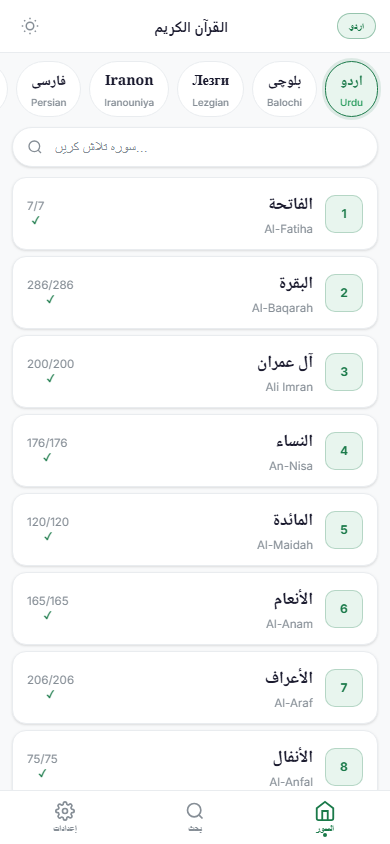
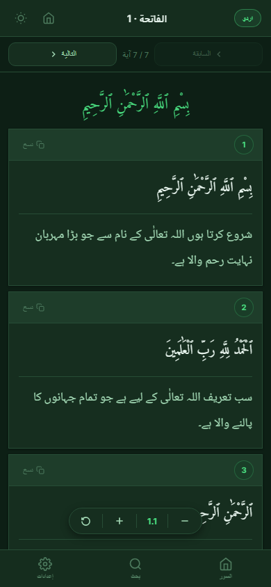
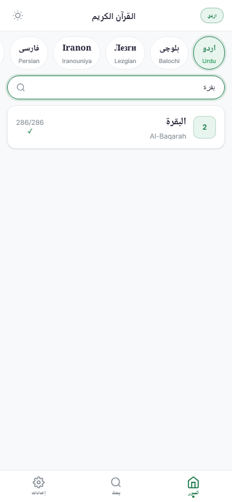

# Quran Translations — Structured JSON

> **#islamic-app** · Open-source · Community digitization project

A personal, community-driven effort to make Quran translations published by the **King Fahd Complex for the Printing of the Holy Quran** (مجمع الملك فهد لطباعة المصحف الشريف) accessible to developers in structured JSON format.

---

## 📱 Live PWA App

A fully offline-capable Progressive Web App built on this dataset — for minority language communities.

🔗 **[alagr.com/app](https://alagr.com/app/)**

- Works **offline** after first load (Service Worker + cache)
- **Add to Home Screen** on Android & iOS — installs like a native app
- 13 languages with automatic RTL/LTR detection
- Original Arabic text alongside every translation
- Dark / Light mode · Adjustable font size · In-app search

<table>
<tr>
<td></td>
<td></td>
<td></td>
</tr>
<tr>
<td align="center">Home (Light)</td>
<td align="center">Ayah View (Dark)</td>
<td align="center">Search</td>
</tr>
</table>

---

> ⚠️ **Important Disclaimer**
>
> **This is an unofficial, personal project.** It is not affiliated with, endorsed by, or produced by the King Fahd Complex for the Printing of the Holy Quran. The translation texts were extracted from publicly available PDFs published by the Complex using automated OCR and AI-assisted tools — a process that **may introduce errors**. The maintainers make no guarantee of accuracy and bear no responsibility for any errors, omissions, or misuse of the data.
>
> Always verify any text against the **official printed editions** from the King Fahd Complex before use in any religious, educational, or production context. If you find an error, please open an Issue with a reference to the official source.

---

## Available Translations

| Language | Language Code | Ayahs | Surahs | Validation |
|---|---|---|---|---|
| Arabic — Uthmani script (عربي) | `ar` | 6236 | 114 | ✅ Source: alquran.cloud |
| English | `en` | 6236 | 114 | ✅ 100% verified |
| German (Deutsch) | `de` | 6236 | 114 | ✅ 100% verified |
| Hindi (हिन्दी) | `hi` | 6236 | 114 | ✅ 100% verified |
| Chinese (中文) | `zh` | 6236 | 114 | ✅ 100% verified |
| Spanish (Español) | `es` | 6236 | 114 | ✅ 100% verified |
| Balochi (بلوچی) | `bal` | 6236 | 114 | ✅ 100% verified |
| Persian / Farsi (فارسی) | `far` | 6236 | 114 | ✅ 100% verified |
| Indonesian (Bahasa Indonesia) | `ind` | 6236 | 114 | ✅ 100% verified |
| Iranouniya / Maranao | `ira` | 6236 | 114 | ✅ 100% verified |
| Kurdish Sorani (کوردی سۆرانی) | `ku` | 6236 | 114 | ✅ 100% verified |
| Lezgian (Лезги) | `lez` | 6236 | 114 | ✅ 100% verified |
| Turkish (Türkçe) | `tr` | 6236 | 114 | ✅ 100% verified |
| Urdu (اردو) | `ur` | 6236 | 114 | ✅ 100% verified |

---

## Repository Structure

```
quran-translations/
├── app/                        ← PWA (Progressive Web App)
│   ├── index.html
│   ├── sw.js
│   ├── manifest.json
│   ├── icon-192.png
│   └── icon-512.png
├── data/
│   ├── ar/
│   │   └── quran_ar.json       ← Arabic Uthmani text (used by PWA)
│   ├── zh/
│   │   ├── quran_zh.json
│   │   └── sha256.txt
│   ├── es/
│   │   ├── quran_es.json
│   │   └── sha256.txt
│   ├── bal/
│   │   ├── quran_bal.json
│   │   └── sha256.txt
│   ├── far/
│   │   ├── quran_far.json
│   │   └── sha256.txt
│   ├── ind/
│   │   ├── quran_ind.json
│   │   └── sha256.txt
│   ├── ira/
│   │   ├── quran_ira.json
│   │   └── sha256.txt
│   ├── en/
│   │   └── quran_en.json
│   ├── de/
│   │   └── quran_de.json
│   ├── hi/
│   │   └── quran_hi.json
│   ├── ku/
│   │   ├── quran_ku.json
│   │   └── sha256.txt
│   ├── lez/
│   │   ├── quran_lez.json
│   │   └── sha256.txt
│   └── ur/
│       ├── quran_ur.json
│       └── sha256.txt
├── schemas/
│   └── translation-schema.json
├── scripts/
│   └── validate.py
├── .github/
│   └── workflows/
│       └── ci.yml
├── LICENSE
└── README.md
```

---

## JSON Format

Each translation file is a JSON array of verse objects:

```json
[
  {
    "id": 1,
    "surah": 1,
    "ayah": 1,
    "text": "Translation text here..."
  },
  {
    "id": 2,
    "surah": 1,
    "ayah": 2,
    "text": "..."
  }
]
```

| Field | Type | Description |
|---|---|---|
| `id` | integer | Global verse index (1–6236) |
| `surah` | integer | Surah number (1–114) |
| `ayah` | integer | Ayah number within surah |
| `text` | string | Translation text |

---

## Quick Start

### JavaScript (Fetch API)

```javascript
const response = await fetch(
  'https://raw.githubusercontent.com/alurini/quran-translations/main/data/ur/quran_ur.json'
);
const verses = await response.json();

// Get all verses of Surah Al-Fatiha
const fatiha = verses.filter(v => v.surah === 1);

// Get a specific verse (Surah 2, Ayah 255 — Ayat Al-Kursi)
const ayatAlKursi = verses.find(v => v.surah === 2 && v.ayah === 255);
console.log(ayatAlKursi.text);
```

### Python

```python
import json, urllib.request

url = 'https://raw.githubusercontent.com/alurini/quran-translations/main/data/ur/quran_ur.json'
with urllib.request.urlopen(url) as r:
    verses = json.loads(r.read())

# Get all verses of Surah Al-Fatiha
fatiha = [v for v in verses if v['surah'] == 1]

# Get a specific verse
ayat_al_kursi = next(v for v in verses if v['surah'] == 2 and v['ayah'] == 255)
print(ayat_al_kursi['text'])
```

### Local Usage

```bash
git clone https://github.com/alurini/quran-translations.git
```

```python
import json

with open('data/ur/quran_ur.json', encoding='utf-8') as f:
    verses = json.load(f)

surah_2 = [v for v in verses if v['surah'] == 2]
print(f"Al-Baqarah has {len(surah_2)} verses")
```

---

## Data Integrity

Every translation file has a corresponding `sha256.txt` checksum. Verify before use:

```bash
# Linux / macOS
sha256sum -c data/ur/sha256.txt

# Windows (PowerShell)
$hash = (Get-FileHash data\ur\quran_ur.json -Algorithm SHA256).Hash.ToLower()
$expected = (Get-Content data\ur\sha256.txt).Split(' ')[0]
if ($hash -eq $expected) { "Verified" } else { "Mismatch!" }
```

---

## Contribution Guidelines

### Accepted Contributions
- Bug reports for text errors via **Issues** (with reference to the official printed edition)
- New translations from King Fahd Complex publications
- Improvements to validation scripts and CI tooling
- Documentation improvements

### Strict Rules

> **The `main` branch is locked. No direct push is permitted.**

- Never manually edit translation text files without opening a formal **Issue** first
- All text corrections must reference the **official King Fahd Complex printed edition**
- Every Pull Request must pass the full **CI validation pipeline** before review
- PRs modifying `.json` files without a corresponding Issue will be closed without review
- Translations must originate exclusively from King Fahd Complex publications

### Submitting a Correction

1. Open an Issue describing the error with the official source reference
2. A maintainer verifies against the printed edition
3. If confirmed, submit a PR — CI must pass completely
4. A second maintainer review is required before merge

---

## Running Validation Locally

```bash
pip install jsonschema
python scripts/validate.py
```

---

## License

This project is licensed under the **MIT License** — see [LICENSE](LICENSE) for details.

The translation texts belong to their respective publishers. The MIT license applies solely to the **code, scripts, and structural formatting** — not to the Quran translation texts themselves.

---

## Acknowledgements

The translation texts digitized in this project were originally published by the **King Fahd Complex for the Printing of the Holy Quran**, Madinah, Kingdom of Saudi Arabia. This project has no official relationship with the Complex and is an independent community effort.

---

## Tags

`quran` `islam` `islamic-app` `quran-json` `quran-api` `quran-translations` `king-fahd-complex` `muslim` `urdu` `persian` `indonesian` `balochi` `kurdish` `lezgian` `maranao` `spanish` `chinese` `english` `german` `hindi` `open-quran`
